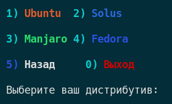
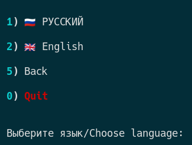

## Документация 🇷🇺

### Автор: Avdyushin "[ANANAZZ](https://github.com/Avdushin)" Dobrynya

#### Дизайнер изображений [ANANAZZ](https://github.com/Avdushin/PIN3APPLE/blob/main/src/assets/walls/ananazz.jpg)/[ANANAS](https://github.com/Avdushin/PIN3APPLE/blob/main/src/assets/walls/ananas.jpg): [SERGO](https://vk.com/s.sm1rn0f) 

##### [PIN3APPLE](https://github.com/Avdushin/PIN3APPLE) - ПО, предназначенное для ускорения процесса настройки Linux дистрибутивов, использующих оконный менеджер I3.

### Как работает программа

##### Чтобы запустить программу нужно:

Клонировать репозиторий - `git clone https://github.com/Avdushin/PIN3APPLE`
    
` Перейти в склонированный репозиторий - cd PIN3APPLE `
    
` Запустить скрипт установки - ./install.sh `

P.s после установки программа запустится самостоятельно, в дальнейшем для её запуска следует использовать файл pineapple.sh.

` ./pineapple.sh `

### Как пользоваться PIN3APPLE

После запуска, вас встречает **главное меню**

##### 

#### ОПЦИИ ГЛАВНОГО МЕНЮ:

* **ДИСТРИБУТИВЫ** - список дистрибутивов для установки на них ПО

* **МОЯ СИСТЕМА** - информация о версии ядра вашей системы

* МАНУАЛ - инструкция, как использовать программу

* **ДЕИНСТАЛЛЯТОР** - открывает программу **uninstaller**, которая позволяет удалить результаты выполнения ПО в пару кликов

*  **ЯЗЫК** - меню выбора языка РУССКИЙ/АНГЛИЙСКИЙ

* **ВЫХОД** - выход из программы

